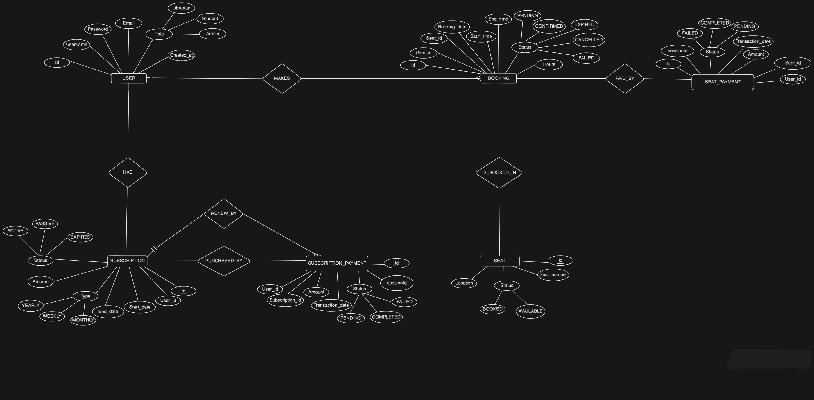

# 📚 iLibrary Backend

<div align="center">


[](https://www.linkedin.com/in/himanshu-raturi/)

**A robust Spring Boot backend for a private study-library management system**

[Features](#-features) • [Tech Stack](#-tech-stack) • [Getting Started](#-getting-started) • [API Documentation](#-api-documentation) • [Database Schema](#-database-schema)

</div>

---

## 📋 Overview

iLibrary Backend is a comprehensive RESTful API service designed for managing private study libraries. It provides a complete solution for user management, subscription handling, seat booking with real-time availability tracking, QR-based authentication, and automated seat release mechanisms.

## ✨ Features

### 🔐 Authentication & Authorization
- **JWT-based Authentication** - Secure token-based user authentication
- **Role-Based Access Control (RBAC)** - Admin and User roles with different permissions
- **Spring Security Integration** - Industry-standard security implementation

### 💺 Seat Management
- **Real-time Seat Availability** - Live tracking of seat status
- **Flexible Booking System** - Book seats for specific durations
- **Automated Seat Release** - Automatic release after booking expiry
- **QR Code Check-in** - Quick and secure seat verification using QR codes

### 💳 Subscription Management
- **Multiple Plans** - Weekly, Monthly, and Yearly subscription options
- **Stripe Payment Integration** - Secure payment processing
- **Auto-renewal Support** - Seamless subscription renewal
- **Subscription Status Tracking** - Monitor active/inactive subscriptions

### 📧 Notifications
- **Email Integration** - Automated email notifications using JavaMail
- **Booking Confirmations** - Email receipts for seat bookings
- **Subscription Alerts** - Renewal and expiry notifications

### 🔧 Additional Features
- **Swagger UI Documentation** - Interactive API documentation at `/swagger-ui.html`
- **Docker Support** - Easy deployment using Docker and Docker Compose
- **Webhook Integration** - Stripe webhooks for payment event handling
- **PDF Invoice Generation** - Automated invoice creation using iText
- **Redis Caching** - Performance optimization with Redis

---

## 🛠 Tech Stack

### Core Technologies
- **Java 17** - Latest LTS version
- **Spring Boot 3.5.6** - Modern application framework
- **Spring Security** - Authentication and authorization
- **Spring Data JPA** - Database abstraction layer
- **Hibernate** - ORM implementation

### Database
- **MySQL 8.0** - Primary relational database
- **Redis** - Caching layer for performance

### Payment & Communication
- **Stripe API** - Payment processing
- **JavaMail** - Email service integration

### Other Libraries
- **JWT (jjwt 0.11.5)** - Token generation and validation
- **Lombok** - Reduces boilerplate code
- **ZXing** - QR code generation and scanning
- **iText 7** - PDF generation for invoices
- **SpringDoc OpenAPI** - API documentation

### DevOps
- **Docker** - Containerization
- **Docker Compose** - Multi-container orchestration
- **Maven** - Build and dependency management

---

## 🚀 Getting Started

### Prerequisites

- Java 17 or higher
- MySQL 8.0 or higher
- Maven 3.6+
- Docker & Docker Compose (optional)
- Redis (optional, for caching)

### Installation

#### Option 1: Local Setup

1. **Clone the repository**
```bash
git clone https://github.com/Himanshu0508Raturi/iLibrary-Backend.git
cd iLibrary-Backend/iLibrary
```

2. **Configure the database**

Create a MySQL database and update `src/main/resources/application.properties`:

```properties
spring.datasource.url=jdbc:mysql://localhost:3306/ilibrary_db
spring.datasource.username=your_username
spring.datasource. password=your_password
spring. jpa.hibernate.ddl-auto=update
```

3. **Configure environment variables**

Set up the following environment variables or add them to `application.properties`:

```properties
# JWT Secret
jwt.secret=your-secret-key

# Email Configuration
spring.mail. host=smtp.gmail.com
spring.mail.port=587
spring.mail.username=your-email@gmail.com
spring. mail.password=your-email-password

# Stripe Configuration
stripe.api.key=your-stripe-secret-key
stripe.webhook.secret=your-webhook-secret

# Redis Configuration (optional)
spring.redis.host=localhost
spring.redis.port=6379
```

4. **Build and run the application**
```bash
./mvnw clean install
./mvnw spring-boot:run
```

The application will start at `http://localhost:8080`

#### Option 2: Docker Setup

1. **Clone the repository**
```bash
git clone https://github.com/Himanshu0508Raturi/iLibrary-Backend.git
cd iLibrary-Backend/iLibrary
```

2. **Run with Docker Compose**
```bash
docker-compose up -d
```

This will start:
- Spring Boot application on port 8080
- MySQL database on port 3306
- Redis (if configured) on port 6379

---

## 📖 API Documentation

### Base URL
```
http://localhost:8080
```

### Authentication
All protected endpoints require JWT Bearer token authorization.

**Header Format:**
```
Authorization: Bearer <your-jwt-token>
```

### API Endpoints

#### 📘 Public APIs
| Method | Endpoint | Description |
|--------|-----------|--------------|
| POST | `/public/signup` | Register a new user |
| POST | `/public/login` | Authenticate and receive JWT token |
| GET | `/public/healthCheck` | Check API health status |

#### 🎫 Booking APIs
| Method | Endpoint | Description |
|--------|-----------|--------------|
| POST | `/booking/seat` | Book a seat for specific duration |
| DELETE | `/booking/cancel/{bookingId}` | Cancel an existing booking |

#### 💳 Subscription APIs
| Method | Endpoint | Description |
|--------|-----------|--------------|
| POST | `/subscription/buy` | Purchase a new subscription |
| PUT | `/subscription/renew` | Renew existing subscription |
| PUT | `/subscription/cancel` | Cancel active subscription |
| GET | `/subscription/status` | Check current subscription status |

#### 🧑‍💼 Admin APIs
| Method | Endpoint | Description |
|--------|-----------|--------------|
| GET | `/admin/allUsers` | List all registered users |
| GET | `/admin/allSeats` | List all seats and their status |
| GET | `/admin/allBooking` | List all bookings |
| GET | `/admin/allSubscription` | List all subscriptions |

#### 💰 Payment APIs
| Method | Endpoint | Description |
|--------|-----------|--------------|
| GET | `/payment/seat` | Initiate seat payment checkout |
| GET | `/payment/subscription` | Initiate subscription payment checkout |

#### ⚙️ Webhook APIs
| Method | Endpoint | Description |
|--------|-----------|--------------|
| POST | `/webhook/subscription` | Handle Stripe subscription webhooks |
| POST | `/webhook/seat` | Handle Stripe seat booking webhooks |

---

### 📚 Example API Usage

#### User Registration
```bash
curl -X POST http://localhost:8080/public/signup \
  -H "Content-Type: application/json" \
  -d '{
    "username": "john_doe",
    "password": "SecurePass123",
    "email": "john@example.com"
  }'
```

#### User Login
```bash
curl -X POST http://localhost:8080/public/login \
  -H "Content-Type: application/json" \
  -d '{
    "username": "john_doe",
    "password": "SecurePass123"
  }'
```

**Response:**
```json
{
  "token": "eyJhbGciOiJIUzI1NiIsInR5cCI6IkpXVCJ9...",
  "type": "Bearer",
  "username": "john_doe",
  "roles": ["ROLE_USER"]
}
```

#### Book a Seat
```bash
curl -X POST http://localhost:8080/booking/seat \
  -H "Authorization: Bearer <your-jwt-token>" \
  -H "Content-Type: application/json" \
  -d '{
    "seatNumber": "A12",
    "hours": 3
  }'
```

#### Check Subscription Status
```bash
curl -X GET http://localhost:8080/subscription/status \
  -H "Authorization: Bearer <your-jwt-token>"
```

---

## 🗂 Data Schemas

### User Registration/Login
```json
{
  "username": "string (required)",
  "password": "string (required, min 6 chars)",
  "email": "string (required, valid email format)"
}
```

### Subscription Request
```json
{
  "type": "WEEKLY | MONTHLY | YEARLY",
  "autoRenew": "boolean (optional)"
}
```

### Seat Booking Request
```json
{
  "seatNumber": "string (required)",
  "hours": "integer (required, min 1, max 12)"
}
```

---

## 🗄 Database Schema

The application uses a relational database with the following main entities:

- **Users** - User accounts and credentials
- **Roles** - User roles (USER, ADMIN)
- **Subscriptions** - User subscription plans
- **Seats** - Available seats in the library
- **Bookings** - Seat booking records
- **Payments** - Payment transaction records



---

## 🧪 Interactive API Documentation

Once the application is running, access the interactive Swagger UI documentation:

```
http://localhost:8080/swagger-ui.html
```

This provides:
- Complete API reference
- Request/response examples
- Try-it-out functionality
- Schema definitions

---

## 🔒 Security Features

- **Password Encryption** - BCrypt hashing for secure password storage
- **JWT Token Expiration** - Configurable token lifetime
- **CORS Configuration** - Controlled cross-origin requests
- **Input Validation** - Bean validation for all inputs
- **SQL Injection Protection** - JPA/Hibernate parameterized queries
- **Rate Limiting** - Protection against abuse (configurable)

---

## 🐳 Docker Deployment

### Build Docker Image
```bash
docker build -t ilibrary-backend .
```

### Run Container
```bash
docker run -p 8080:8080 \
  -e SPRING_DATASOURCE_URL=jdbc:mysql://host.docker.internal:3306/ilibrary_db \
  -e SPRING_DATASOURCE_USERNAME=root \
  -e SPRING_DATASOURCE_PASSWORD=password \
  ilibrary-backend
```

### Docker Compose
```bash
docker-compose up -d
```

---

## 📝 Configuration

Key configuration properties in `application.properties`:

```properties
# Server Configuration
server.port=8080

# Database Configuration
spring.datasource.url=jdbc:mysql://localhost:3306/ilibrary_db
spring.jpa.hibernate.ddl-auto=update
spring.jpa.show-sql=true

# JWT Configuration
jwt.secret=${JWT_SECRET}
jwt.expiration=86400000

# Email Configuration
spring.mail.host=smtp.gmail.com
spring.mail.port=587

# Stripe Configuration
stripe.api.key=${STRIPE_API_KEY}

# File Upload
spring.servlet.multipart.max-file-size=10MB
```

---

## 🧪 Testing

Run the test suite:

```bash
./mvnw test
```

Run with coverage:

```bash
./mvnw test jacoco:report
```

---

## 🤝 Contributing

Contributions are welcome! Please follow these steps:

1. Fork the repository
2. Create a feature branch (`git checkout -b feature/AmazingFeature`)
3. Commit your changes (`git commit -m 'Add some AmazingFeature'`)
4. Push to the branch (`git push origin feature/AmazingFeature`)
5. Open a Pull Request

---

## 📄 License

This project is open source and available for educational purposes.

---

## 👨‍💻 Author

**Himanshu Raturi**

[](https://www.linkedin.com/in/himanshu-raturi/)
[](https://github.com/Himanshu0508Raturi)

---

## 🙏 Acknowledgments

- Spring Boot community for excellent documentation
- Stripe for payment integration
- All contributors and supporters of this project

---

## 📞 Support

For support, email raturihimanshu077@gmail.com or create an issue in this repository.

---

<div align="center">

**If you found this project helpful, please consider giving it a ⭐! **

</div>